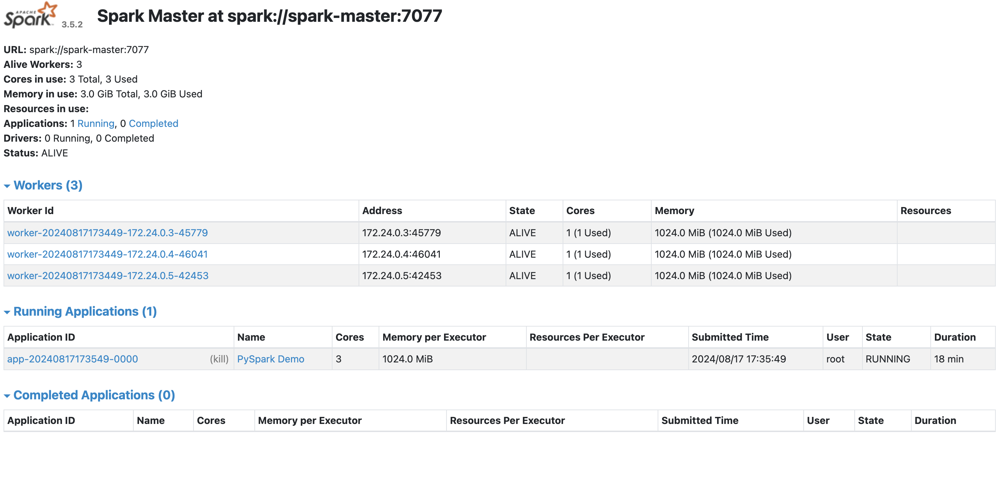
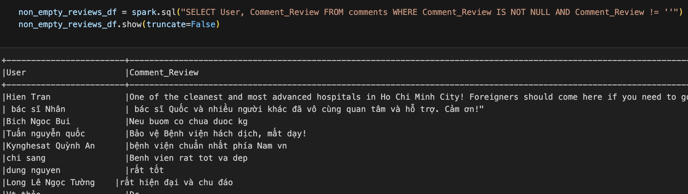

# Demo SparkSQL
# Yêu cầu cài đặt
Docker compose: https://docs.docker.com/compose/install/

# Các bước chạy
Sau khi cài đặt docker compose chạy theo các bước sau:
+ B1: chạy lệnh `./start-service.sh` => khởi động spark cluster
+ B2: chạy lệnh `docker compose up` => chạy service jupyter notebook để chạy demo
Để stop các tác vụ chạy lệnh: `./stop-service`

# Kết quả thu được
## Setup Spark với 3 worker node

## Chạy các tác vụ xử lý data trên cụm Spark đã setup

(Cụ thể hơn xem thêm ở file: `sparksql-demo.ipynb`)